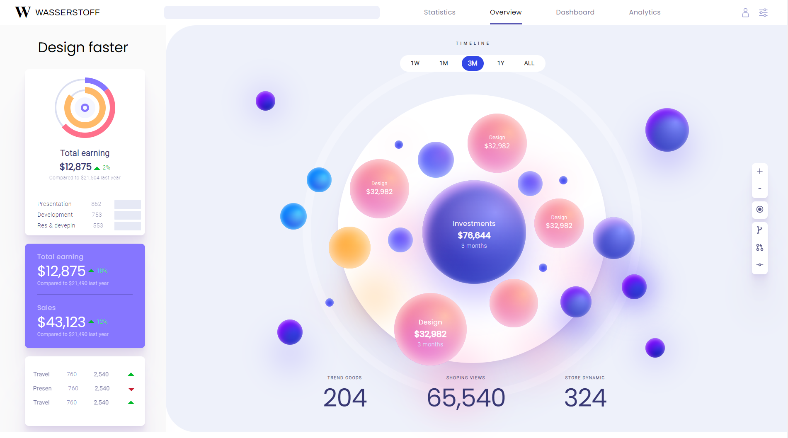

# UI Design for WASSERTOFF.PVT.LTD

This project is created according to the clients requirements.\
Contains specif Ascpect Ratio of `1920 X 1080`.

## Technologies Used

`react.js` `figma` `vanila css` `html` `javascript`

### See Live Demo

[Live Demoe Link :](https://ui-design-noman-shaikh.vercel.app/) to view it in your browser.

**For the best Experience, use 1920 X 1080 Resolution.**

## Learn More

You can learn more in the [Create React App documentation](https://facebook.github.io/create-react-app/docs/getting-started).

To learn React, check out the [React documentation](https://reactjs.org/).

